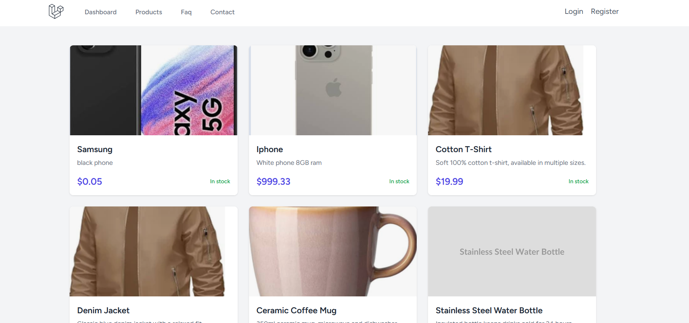
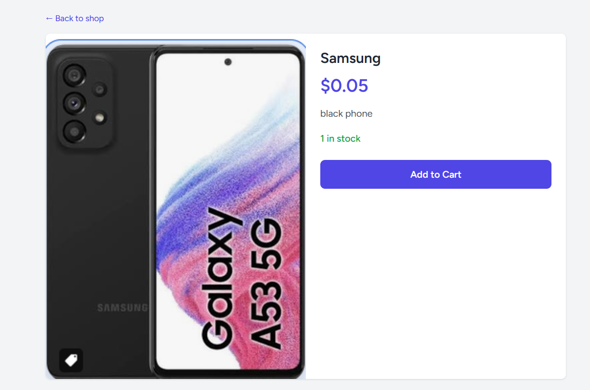
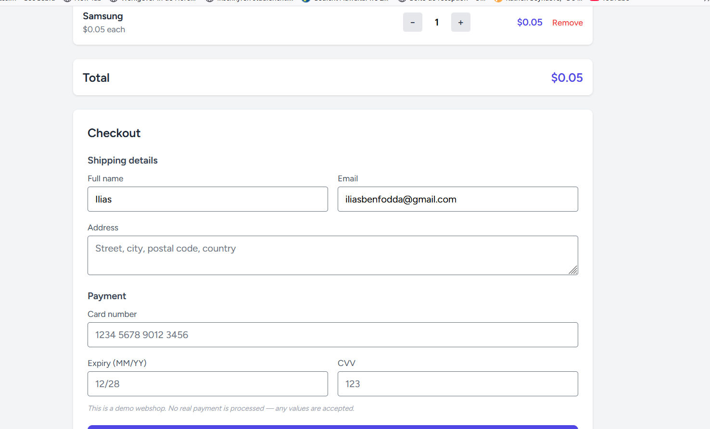
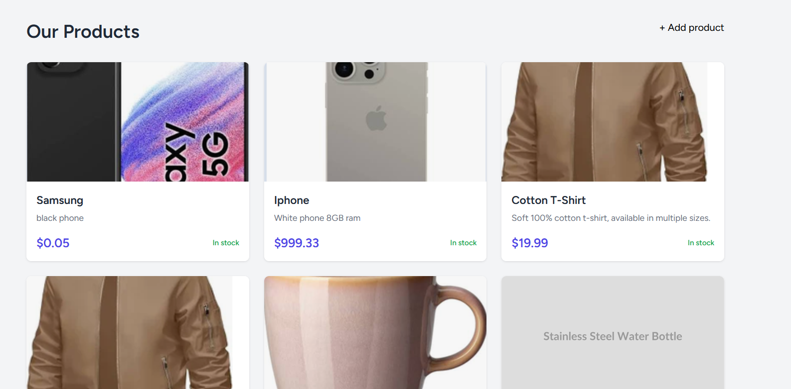
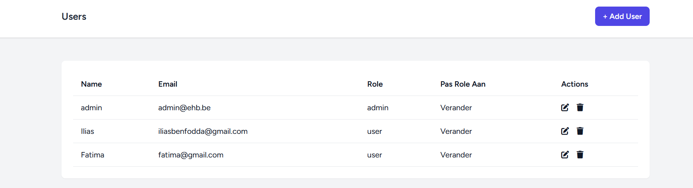
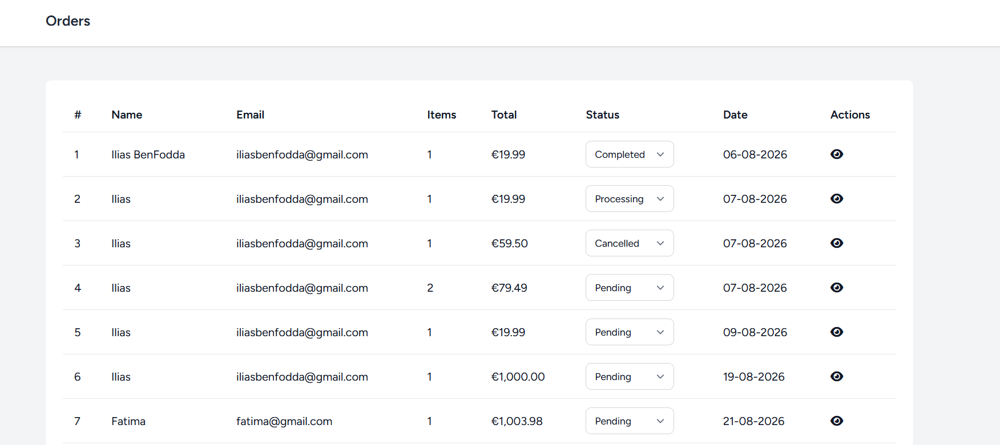
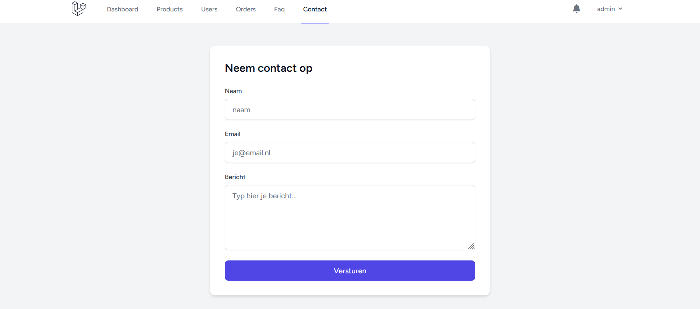

# Webshop  
- Basic webshop built in Laravel 13. Visitors can browse and order products,admin manage products users and orders. 
## Functionalities

**Visitor**
- Browse products and product details
- Register and log in
- Read the FAQ
- Send a message through the contact form
  **Customer**
- Add products to a shopping cart
- Check out with shipping and payment details
- Manage their own profile, including a profile picture
  **Admin**
- Create, edit and delete products, including image upload
- Create, edit and delete users, and change their role
- View all orders and their order lines
- Update the status of an order
- Receive a navbar notification when a new order is placed
## Requirements
- PHP 8.3 or higher
- Composer
- Node.js + npm
- Laravel Herd (or any local server)
### Installation

```bash
git clone https://github.com/IliasBenFodda/Php-Project.git
cd Php-Project
 
composer install
npm install
 
cp .env.example .env
php artisan key:generate
 
touch database/database.sqlite
php artisan migrate --seed
 
php artisan storage:link
 
npm run dev
```
### Test accounts

| Role     | Email       | Password |
|----------|-------------|----------|
| Admin    | admin@ehb.be | Password!321 |

## Technical requirements

Where each required technique is implemented in the code.

| # | Requirement | File | Line(s) | Notes |
|---|-------------|------|---------|-------|
| 1 | Database migrations | `database/migrations/*_create_products_table.php` | | Products, orders, order_items, users |
| 2 | Eloquent models and relationships | `app/Models/Order.php` | | `hasMany` items, `belongsTo` user |
| 3 | Authentication | `routes/auth.php` | | Laravel Breeze |
| 4 | Authorisation / middleware | `app/Http/Middleware/IsAdmin.php` | | Aliased in `bootstrap/app.php` |
| 5 | CRUD | `app/Http/Controllers/ProductController.php` | | Full create/read/update/delete |
| 6 | Form validation | `app/Http/Controllers/ProductController.php` | | `$request->validate()` |
| 7 | File upload | `app/Http/Controllers/ProductController.php` | | Product image, stored on the `public` disk |
| 8 | Sending mail | `app/Mail/ContactFormMail.php` | | Contact form via Mailtrap |
| 9 | Notifications | `app/Notifications/NewOrderNotification.php` | | Database notifications, shown in the navbar |
| 10 | Blade components and layouts | `resources/views/layouts/navigation.blade.php` | | Breeze components, `<x-app-layout>` |
| 11 | Database transaction | `app/Http/Controllers/CartController.php` | | Order + order lines created atomically |
| 12 | Sessions | `app/Http/Controllers/CartController.php` | | Shopping cart stored in the session |

## Screenshot
Screenshots

Product overview


Shopping cart


Checkout


Admin — products


Admin — users


Admin — orders


Contact form

# Gebruikte bronnen

- Login
    - https://medium.com/@galiherlanggadev/laravel-auth-page-with-breeze-d51db7b117e3
    - https://laraveldaily.com/lesson/laravel-beginners/login-register-breeze
- Migraties
    - https://laraveldaily.com/lesson/laravel-from-scratch/database-migrations
    - https://stackoverflow.com/questions/30220377/how-do-laravel-migrations-work
    - https://laravel.com/docs/13.x/migrations
- Profielfoto
    - https://laravel-news.com/uploading-files-laravel
    - https://medium.com/@rohitdhiman91/file-upload-in-laravel-a-beginner-friendly-guide-73952ed5a34a
- Email
- https://medium.com/@rohitdhiman91/sending-emails-in-laravel-with-mailtrap-a-beginners-guide-06ab2c69f64c
